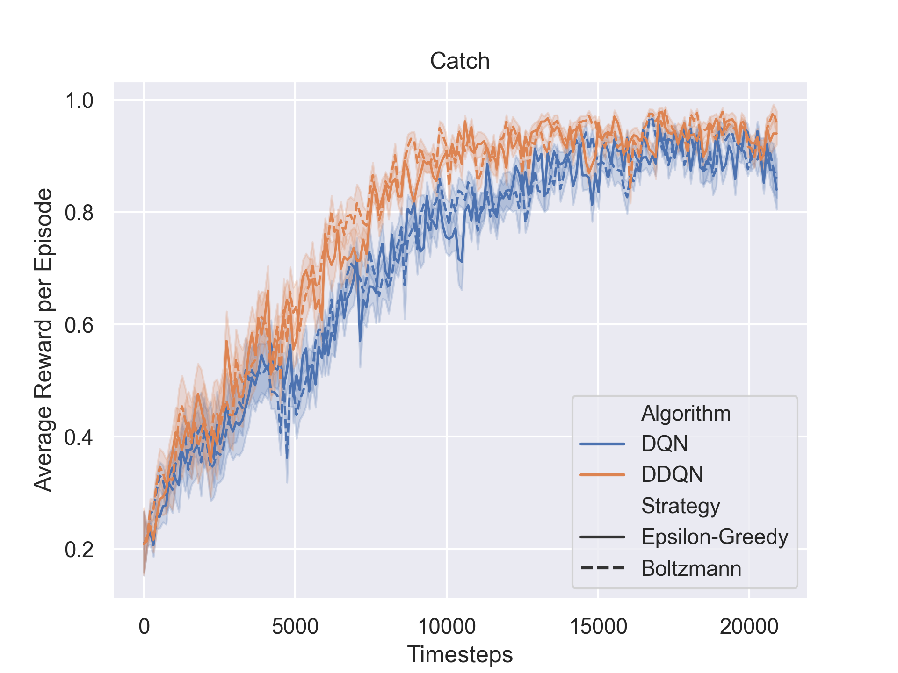

# deep-reinforcement-learning 2023 group 44

The self implemented **DQN** and **Double DQN** experiments can be found in `dqn.ipynb`, while the experiments comparing **DQN** to **A2C** can be run via `dqn_a2c_script.sh` script. There are 2 independed `requirements.txt` files, which should be used sepparatly to create two distinct virtual enviroments.

